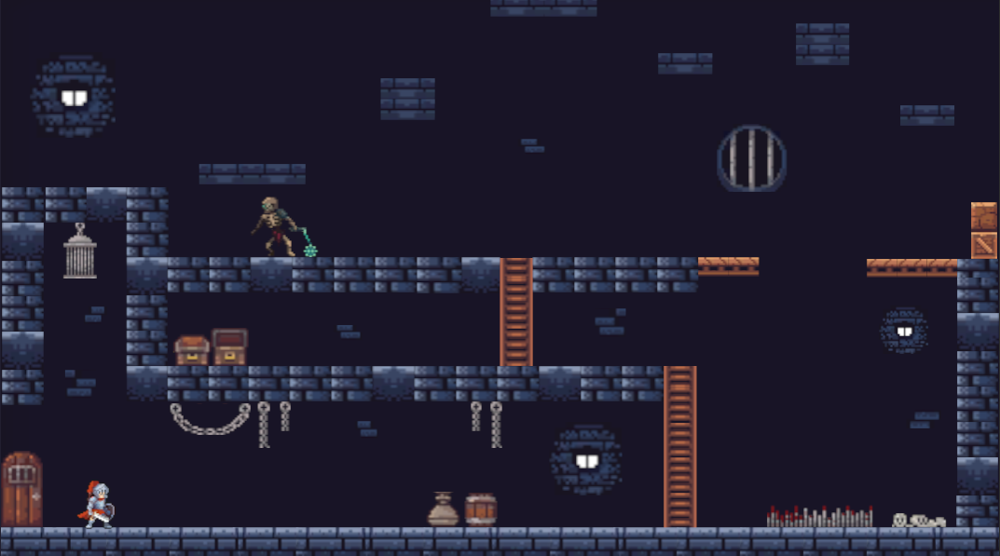
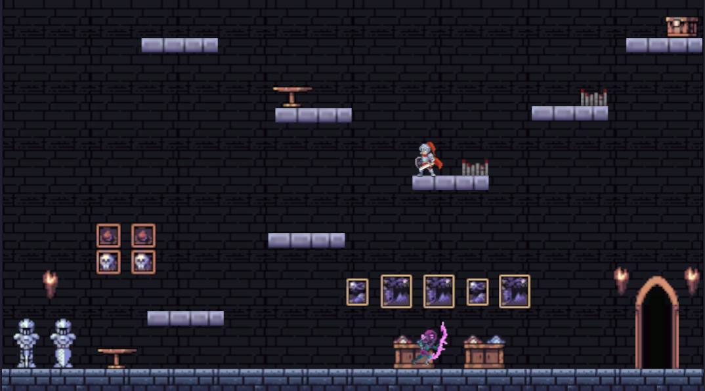
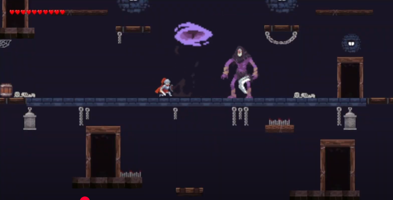
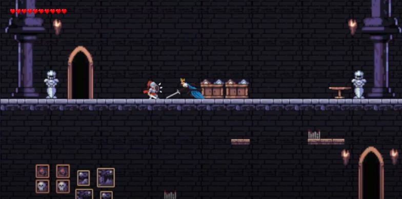

## Table of Contents

* [Brief Overview](#brief-overview-)
* [Game Pitch](#game-pitch)
* [Game Controls](#game-controls)
* [Background of the Game's Story](#background-of-the-games-story)
* [Design and Illustrations](#design-and-illustrations)
* [Gameplay and Trailer](#gameplay-and-trailer)
* [Further Developments](#further-developments)
* [Play Now](#play-now)
* [Team](#team)

## Brief Overview 
The Kings Fall is a 2D platformer where players focus on vertical progression by moving upwards through all the levels of the game. Players must avoid dying from enemy attacks, traps, hazards and falling to lower levels which resets progress back to that fallen point. 

## Game Pitch
Our platformer features a focus on elements to provide a 2D fast-paced, vertical, and combat-intensive setting within a medieval environment of 16-bit pixel art aesthetic. There are two stages for the dungeon and castle areas. Each stage features five levels, with increasing difficulty in both the layout, traps, and enemy types.

This game is based on precise jumping action, but by adding enemy battles and gimmicks, it develops more strategic and tense gameplay. Judge the timing of your jumps, dodge enemy attacks, and advance to the top the tension of knowing that a single mistake could lead to a big fall will captivate players.

**_Deadly_** spikes are laid out on platforms throughout many levels. **_False_** platforms appear solid but disappear on touch. Doors offer a puzzle, choose the right one to progress to a higher platform within a level and for progression. Trampolines provide a jump boost for the player to use for landing on a flat surface, but beware the hazards in place. 

A boss is featured within the last level of each stage and has their own set of attacks. Background music for each level builds upon the tone of the game, with each boss having their own theme.

## Game Controls
- A or left arrow key to move left
- D or right arrow key to move right
- Space key to jump
- E key to interact with the doors
- Left click to attack
- Right click to parry an attack
- Up and down arrow keys to move selection arrows
- Esc key to pause the game
- Enter key to select

## Background of the Game's Story
The player's character is a knight, formerly a part of the highly-decorated King's Circle. Under wrongful accusations of betrayal, he is sent to the dungeon and the lower dwellings of the kingdom. Upon his imprisonment, the knight is determined to escape and find his way up through to the King's quarters in the castle in order to seek retribution. 

## Design and Illustrations

<figure style="text-align:center;">
  <figcaption style="color:black;"><em>Start of Dungeon Area</em></figcaption>
  
</figure>

<!-- Padding for space between sections-->

    

<figure style="text-align:center;">
  <figcaption style="color:black;"><em>Start of Castle Area</em></figcaption>
  
</figure>

<!-- Padding for space between sections-->

    

<figure style="text-align:center;">
  <figcaption style="color:black;"><em>Dungeon Boss</em></figcaption>
  
</figure>

<!-- Padding for space between sections-->

    

<figure style="text-align:center;">
  <figcaption style="color:black;"><em>Castle Boss</em></figcaption>
  
</figure>

<!-- Padding for space between sections-->

    

## Gameplay and Trailer

<iframe src="https://drive.google.com/file/d/1-KWpWHjL7XYGL1t0Dy-e0OdJfh5YFbWd/preview"
width="640" height="360" allow="autoplay" allowfullscreen>
</iframe>

## Further Developments
In the future, potential implementations will focus on adding features that we initially planned on having but did not have sufficient time to fully carry out. This includes a shop area, which would allow the player to purchase equipment that gives that upgrades weapons or stats to make progression easier. We also wanted to improve the movement system so that there are mechanics for air-dashing or wall-jumping for a better experience. 

## Play Now!
[Download King's Fall (.zip)][def]
[def]: downloads/kings-fall.zip

## Team
Spaghetti Code consists of three members:
- Gerald Matthew Huff
- Kenneth Allen de Guzman
- Kairi Tanaka
